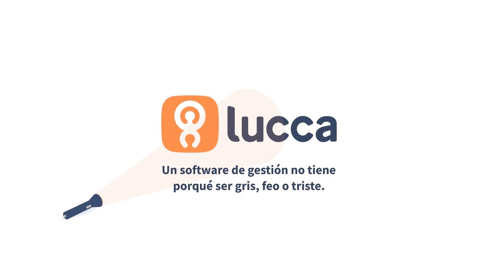

<div align="left">

[](https://lucca-hr.com)

# Lucca<a id="lucca"></a>

Welcome on the documentation for the Organization Structure API


</div>

## Table of Contents<a id="table-of-contents"></a>

<!-- toc -->

- [Requirements](#requirements)
- [Installation](#installation)
- [Getting Started](#getting-started)
- [Async](#async)
- [Raw HTTP Response](#raw-http-response)
- [Reference](#reference)
  * [`luccaorganization.axis_sections.create_new_axis_section`](#luccaorganizationaxis_sectionscreate_new_axis_section)
  * [`luccaorganization.axis_sections.delete_by_id`](#luccaorganizationaxis_sectionsdelete_by_id)
  * [`luccaorganization.axis_sections.get_by_id`](#luccaorganizationaxis_sectionsget_by_id)
  * [`luccaorganization.axis_sections.list`](#luccaorganizationaxis_sectionslist)
  * [`luccaorganization.axis_sections.list_0`](#luccaorganizationaxis_sectionslist_0)
  * [`luccaorganization.axis_sections.update_by_id`](#luccaorganizationaxis_sectionsupdate_by_id)
  * [`luccaorganization.departments.get_all`](#luccaorganizationdepartmentsget_all)
  * [`luccaorganization.departments.get_by_id`](#luccaorganizationdepartmentsget_by_id)
  * [`luccaorganization.departments.list_tree`](#luccaorganizationdepartmentslist_tree)

<!-- tocstop -->

## Requirements<a id="requirements"></a>

Python >=3.7

## Installation<a id="installation"></a>
<div align="center">
  <a href="https://konfigthis.com/sdk-sign-up?company=Lucca&serviceName=Organization&language=Python">
    
  </a>
</div>

## Getting Started<a id="getting-started"></a>

```python
from pprint import pprint
from lucca_organization_python_sdk import LuccaOrganization, ApiException

luccaorganization = LuccaOrganization(
    authorization="YOUR_API_KEY",
)

try:
    # Create a new AxisSection
    create_new_axis_section_response = (
        luccaorganization.axis_sections.create_new_axis_section(
            description=None,
            id=1,
            name="string_example",
            url="string_example",
            code="string_example",
            multilingual_name="string_example",
            owner_id=None,
            start_on=None,
            end_on=None,
            active=True,
            axis_id=1,
            parent_axis_sections=[
                {
                    "code": "code_example",
                    "multilingual_name": "multilingual_name_example",
                    "active": True,
                    "axis_id": 1,
                }
            ],
            children_axis_sections=[
                {
                    "code": "code_example",
                    "multilingual_name": "multilingual_name_example",
                    "active": True,
                    "axis_id": 1,
                }
            ],
        )
    )
    print(create_new_axis_section_response)
except ApiException as e:
    print("Exception when calling AxisSectionsApi.create_new_axis_section: %s\n" % e)
    pprint(e.body)
    pprint(e.headers)
    pprint(e.status)
    pprint(e.reason)
    pprint(e.round_trip_time)
```

## Async<a id="async"></a>

`async` support is available by prepending `a` to any method.

```python
import asyncio
from pprint import pprint
from lucca_organization_python_sdk import LuccaOrganization, ApiException

luccaorganization = LuccaOrganization(
    authorization="YOUR_API_KEY",
)


async def main():
    try:
        # Create a new AxisSection
        create_new_axis_section_response = (
            await luccaorganization.axis_sections.acreate_new_axis_section(
                description=None,
                id=1,
                name="string_example",
                url="string_example",
                code="string_example",
                multilingual_name="string_example",
                owner_id=None,
                start_on=None,
                end_on=None,
                active=True,
                axis_id=1,
                parent_axis_sections=[
                    {
                        "code": "code_example",
                        "multilingual_name": "multilingual_name_example",
                        "active": True,
                        "axis_id": 1,
                    }
                ],
                children_axis_sections=[
                    {
                        "code": "code_example",
                        "multilingual_name": "multilingual_name_example",
                        "active": True,
                        "axis_id": 1,
                    }
                ],
            )
        )
        print(create_new_axis_section_response)
    except ApiException as e:
        print(
            "Exception when calling AxisSectionsApi.create_new_axis_section: %s\n" % e
        )
        pprint(e.body)
        pprint(e.headers)
        pprint(e.status)
        pprint(e.reason)
        pprint(e.round_trip_time)


asyncio.run(main())
```

## Raw HTTP Response<a id="raw-http-response"></a>

To access raw HTTP response values, use the `.raw` namespace.

```python
from pprint import pprint
from lucca_organization_python_sdk import LuccaOrganization, ApiException

luccaorganization = LuccaOrganization(
    authorization="YOUR_API_KEY",
)

try:
    # Create a new AxisSection
    create_new_axis_section_response = (
        luccaorganization.axis_sections.raw.create_new_axis_section(
            description=None,
            id=1,
            name="string_example",
            url="string_example",
            code="string_example",
            multilingual_name="string_example",
            owner_id=None,
            start_on=None,
            end_on=None,
            active=True,
            axis_id=1,
            parent_axis_sections=[
                {
                    "code": "code_example",
                    "multilingual_name": "multilingual_name_example",
                    "active": True,
                    "axis_id": 1,
                }
            ],
            children_axis_sections=[
                {
                    "code": "code_example",
                    "multilingual_name": "multilingual_name_example",
                    "active": True,
                    "axis_id": 1,
                }
            ],
        )
    )
    pprint(create_new_axis_section_response.body)
    pprint(create_new_axis_section_response.body["data"])
    pprint(create_new_axis_section_response.headers)
    pprint(create_new_axis_section_response.status)
    pprint(create_new_axis_section_response.round_trip_time)
except ApiException as e:
    print("Exception when calling AxisSectionsApi.create_new_axis_section: %s\n" % e)
    pprint(e.body)
    pprint(e.headers)
    pprint(e.status)
    pprint(e.reason)
    pprint(e.round_trip_time)
```


## Reference<a id="reference"></a>
### `luccaorganization.axis_sections.create_new_axis_section`<a id="luccaorganizationaxis_sectionscreate_new_axis_section"></a>

Create a new AxisSection.

#### 🛠️ Usage<a id="🛠️-usage"></a>

```python
create_new_axis_section_response = (
    luccaorganization.axis_sections.create_new_axis_section(
        description=None,
        id=1,
        name="string_example",
        url="string_example",
        code="string_example",
        multilingual_name="string_example",
        owner_id=None,
        start_on=None,
        end_on=None,
        active=True,
        axis_id=1,
        parent_axis_sections=[
            {
                "code": "code_example",
                "multilingual_name": "multilingual_name_example",
                "active": True,
                "axis_id": 1,
            }
        ],
        children_axis_sections=[
            {
                "code": "code_example",
                "multilingual_name": "multilingual_name_example",
                "active": True,
                "axis_id": 1,
            }
        ],
    )
)
```

#### ⚙️ Parameters<a id="⚙️-parameters"></a>

##### description: [`Union[bool, date, datetime, dict, float, int, list, str, None]`](./lucca_organization_python_sdk/type/typing_union_bool_date_datetime_dict_float_int_list_str_none.py)<a id="description-unionbool-date-datetime-dict-float-int-list-str-nonelucca_organization_python_sdktypetyping_union_bool_date_datetime_dict_float_int_list_str_nonepy"></a>

##### id: `int`<a id="id-int"></a>

##### name: `str`<a id="name-str"></a>

##### url: `str`<a id="url-str"></a>

##### code: `str`<a id="code-str"></a>

##### multilingual_name: `str`<a id="multilingual_name-str"></a>

##### owner_id: [`Union[bool, date, datetime, dict, float, int, list, str, None]`](./lucca_organization_python_sdk/type/typing_union_bool_date_datetime_dict_float_int_list_str_none.py)<a id="owner_id-unionbool-date-datetime-dict-float-int-list-str-nonelucca_organization_python_sdktypetyping_union_bool_date_datetime_dict_float_int_list_str_nonepy"></a>

##### start_on: [`Union[bool, date, datetime, dict, float, int, list, str, None]`](./lucca_organization_python_sdk/type/typing_union_bool_date_datetime_dict_float_int_list_str_none.py)<a id="start_on-unionbool-date-datetime-dict-float-int-list-str-nonelucca_organization_python_sdktypetyping_union_bool_date_datetime_dict_float_int_list_str_nonepy"></a>

##### end_on: [`Union[bool, date, datetime, dict, float, int, list, str, None]`](./lucca_organization_python_sdk/type/typing_union_bool_date_datetime_dict_float_int_list_str_none.py)<a id="end_on-unionbool-date-datetime-dict-float-int-list-str-nonelucca_organization_python_sdktypetyping_union_bool_date_datetime_dict_float_int_list_str_nonepy"></a>

##### active: `bool`<a id="active-bool"></a>

##### axis_id: `int`<a id="axis_id-int"></a>

##### parent_axis_sections: List[`AxisSectionTreeless`]<a id="parent_axis_sections-listaxissectiontreeless"></a>

##### children_axis_sections: List[`AxisSectionTreeless`]<a id="children_axis_sections-listaxissectiontreeless"></a>

#### ⚙️ Request Body<a id="⚙️-request-body"></a>

[`AxisSection`](./lucca_organization_python_sdk/type/axis_section.py)
#### 🔄 Return<a id="🔄-return"></a>

[`AxissectionsCreateNewAxisSectionResponse`](./lucca_organization_python_sdk/pydantic/axissections_create_new_axis_section_response.py)

#### 🌐 Endpoint<a id="🌐-endpoint"></a>

`/api/v3/axisSections` `post`

[🔙 **Back to Table of Contents**](#table-of-contents)

---

### `luccaorganization.axis_sections.delete_by_id`<a id="luccaorganizationaxis_sectionsdelete_by_id"></a>

Delete an AxisSection by id

#### 🛠️ Usage<a id="🛠️-usage"></a>

```python
luccaorganization.axis_sections.delete_by_id(
    axis_section_id=1,
)
```

#### ⚙️ Parameters<a id="⚙️-parameters"></a>

##### axis_section_id: `int`<a id="axis_section_id-int"></a>

#### 🌐 Endpoint<a id="🌐-endpoint"></a>

`/api/v3/axisSections/{axisSectionId}` `delete`

[🔙 **Back to Table of Contents**](#table-of-contents)

---

### `luccaorganization.axis_sections.get_by_id`<a id="luccaorganizationaxis_sectionsget_by_id"></a>

Retrieve a single AxisSection by its unique identifier.

#### 🛠️ Usage<a id="🛠️-usage"></a>

```python
get_by_id_response = luccaorganization.axis_sections.get_by_id(
    axis_section_id=1,
)
```

#### ⚙️ Parameters<a id="⚙️-parameters"></a>

##### axis_section_id: `int`<a id="axis_section_id-int"></a>

#### 🔄 Return<a id="🔄-return"></a>

[`AxissectionsGetByIdResponse`](./lucca_organization_python_sdk/pydantic/axissections_get_by_id_response.py)

#### 🌐 Endpoint<a id="🌐-endpoint"></a>

`/api/v3/axisSections/{axisSectionId}` `get`

[🔙 **Back to Table of Contents**](#table-of-contents)

---

### `luccaorganization.axis_sections.list`<a id="luccaorganizationaxis_sectionslist"></a>

List all Axes satisfying query filters.

#### 🛠️ Usage<a id="🛠️-usage"></a>

```python
list_response = luccaorganization.axis_sections.list(
    paging="100,0",
    id=[1],
    is_active=True,
)
```

#### ⚙️ Parameters<a id="⚙️-parameters"></a>

##### paging: `str`<a id="paging-str"></a>

{offset},{limit}. Defaults to 0,1000.

##### id: List[`int`]<a id="id-listint"></a>

Filter on axes unique identifiers.

##### is_active: `bool`<a id="is_active-bool"></a>

Filter on axes active status.

#### 🔄 Return<a id="🔄-return"></a>

[`AxissectionsListResponse`](./lucca_organization_python_sdk/pydantic/axissections_list_response.py)

#### 🌐 Endpoint<a id="🌐-endpoint"></a>

`/api/v3/axes` `get`

[🔙 **Back to Table of Contents**](#table-of-contents)

---

### `luccaorganization.axis_sections.list_0`<a id="luccaorganizationaxis_sectionslist_0"></a>

List all AxisSections satisfying query filters.

#### 🛠️ Usage<a id="🛠️-usage"></a>

```python
list_0_response = luccaorganization.axis_sections.list_0(
    paging="100,0",
    axis_id=[1],
    owner_id=[1],
    active=True,
)
```

#### ⚙️ Parameters<a id="⚙️-parameters"></a>

##### paging: `str`<a id="paging-str"></a>

{offset},{limit}. Defaults to 0,1000.

##### axis_id: List[`int`]<a id="axis_id-listint"></a>

Filter on the axis it belongs to.

##### owner_id: List[`int`]<a id="owner_id-listint"></a>

Filter on the owner managing it.

##### active: `bool`<a id="active-bool"></a>

Filter on active status.

#### 🔄 Return<a id="🔄-return"></a>

[`AxissectionsList200Response`](./lucca_organization_python_sdk/pydantic/axissections_list200_response.py)

#### 🌐 Endpoint<a id="🌐-endpoint"></a>

`/api/v3/axisSections` `get`

[🔙 **Back to Table of Contents**](#table-of-contents)

---

### `luccaorganization.axis_sections.update_by_id`<a id="luccaorganizationaxis_sectionsupdate_by_id"></a>

Partial or complete update to an existing AxisSection.

#### 🛠️ Usage<a id="🛠️-usage"></a>

```python
update_by_id_response = luccaorganization.axis_sections.update_by_id(
    axis_section_id=1,
    description=None,
    id=1,
    name="string_example",
    url="string_example",
    code="string_example",
    multilingual_name="string_example",
    owner_id=None,
    start_on=None,
    end_on=None,
    active=True,
    axis_id=1,
    parent_axis_sections=[
        {
            "code": "code_example",
            "multilingual_name": "multilingual_name_example",
            "active": True,
            "axis_id": 1,
        }
    ],
    children_axis_sections=[
        {
            "code": "code_example",
            "multilingual_name": "multilingual_name_example",
            "active": True,
            "axis_id": 1,
        }
    ],
)
```

#### ⚙️ Parameters<a id="⚙️-parameters"></a>

##### axis_section_id: `int`<a id="axis_section_id-int"></a>

##### description: [`Union[bool, date, datetime, dict, float, int, list, str, None]`](./lucca_organization_python_sdk/type/typing_union_bool_date_datetime_dict_float_int_list_str_none.py)<a id="description-unionbool-date-datetime-dict-float-int-list-str-nonelucca_organization_python_sdktypetyping_union_bool_date_datetime_dict_float_int_list_str_nonepy"></a>

##### id: `int`<a id="id-int"></a>

##### name: `str`<a id="name-str"></a>

##### url: `str`<a id="url-str"></a>

##### code: `str`<a id="code-str"></a>

##### multilingual_name: `str`<a id="multilingual_name-str"></a>

##### owner_id: [`Union[bool, date, datetime, dict, float, int, list, str, None]`](./lucca_organization_python_sdk/type/typing_union_bool_date_datetime_dict_float_int_list_str_none.py)<a id="owner_id-unionbool-date-datetime-dict-float-int-list-str-nonelucca_organization_python_sdktypetyping_union_bool_date_datetime_dict_float_int_list_str_nonepy"></a>

##### start_on: [`Union[bool, date, datetime, dict, float, int, list, str, None]`](./lucca_organization_python_sdk/type/typing_union_bool_date_datetime_dict_float_int_list_str_none.py)<a id="start_on-unionbool-date-datetime-dict-float-int-list-str-nonelucca_organization_python_sdktypetyping_union_bool_date_datetime_dict_float_int_list_str_nonepy"></a>

##### end_on: [`Union[bool, date, datetime, dict, float, int, list, str, None]`](./lucca_organization_python_sdk/type/typing_union_bool_date_datetime_dict_float_int_list_str_none.py)<a id="end_on-unionbool-date-datetime-dict-float-int-list-str-nonelucca_organization_python_sdktypetyping_union_bool_date_datetime_dict_float_int_list_str_nonepy"></a>

##### active: `bool`<a id="active-bool"></a>

##### axis_id: `int`<a id="axis_id-int"></a>

##### parent_axis_sections: List[`AxisSectionTreeless`]<a id="parent_axis_sections-listaxissectiontreeless"></a>

##### children_axis_sections: List[`AxisSectionTreeless`]<a id="children_axis_sections-listaxissectiontreeless"></a>

#### ⚙️ Request Body<a id="⚙️-request-body"></a>

[`AxisSection`](./lucca_organization_python_sdk/type/axis_section.py)
#### 🔄 Return<a id="🔄-return"></a>

[`AxissectionsUpdateByIdResponse`](./lucca_organization_python_sdk/pydantic/axissections_update_by_id_response.py)

#### 🌐 Endpoint<a id="🌐-endpoint"></a>

`/api/v3/axisSections/{axisSectionId}` `put`

[🔙 **Back to Table of Contents**](#table-of-contents)

---

### `luccaorganization.departments.get_all`<a id="luccaorganizationdepartmentsget_all"></a>

List all Departments satisfying query filters.

#### 🛠️ Usage<a id="🛠️-usage"></a>

```python
get_all_response = luccaorganization.departments.get_all(
    paging="100,0",
    head_id=1,
    parent_id=1,
)
```

#### ⚙️ Parameters<a id="⚙️-parameters"></a>

##### paging: `str`<a id="paging-str"></a>

{offset},{limit}. Defaults to 0,1000.

##### head_id: `int`<a id="head_id-int"></a>

##### parent_id: `int`<a id="parent_id-int"></a>

#### 🔄 Return<a id="🔄-return"></a>

[`DepartmentsGetAllResponse`](./lucca_organization_python_sdk/pydantic/departments_get_all_response.py)

#### 🌐 Endpoint<a id="🌐-endpoint"></a>

`/api/v3/departments` `get`

[🔙 **Back to Table of Contents**](#table-of-contents)

---

### `luccaorganization.departments.get_by_id`<a id="luccaorganizationdepartmentsget_by_id"></a>

Retrieve a single Department by its unique identifier.

#### 🛠️ Usage<a id="🛠️-usage"></a>

```python
get_by_id_response = luccaorganization.departments.get_by_id(
    department_id=1,
)
```

#### ⚙️ Parameters<a id="⚙️-parameters"></a>

##### department_id: `int`<a id="department_id-int"></a>

#### 🔄 Return<a id="🔄-return"></a>

[`DepartmentsGetByIdResponse`](./lucca_organization_python_sdk/pydantic/departments_get_by_id_response.py)

#### 🌐 Endpoint<a id="🌐-endpoint"></a>

`/api/v3/departments/{departmentId}` `get`

[🔙 **Back to Table of Contents**](#table-of-contents)

---

### `luccaorganization.departments.list_tree`<a id="luccaorganizationdepartmentslist_tree"></a>

List all departments as a tree.
Remark: first node is always empty and represents the starting point of the tree as multiple departments might be set to the highest level. 

#### 🛠️ Usage<a id="🛠️-usage"></a>

```python
list_tree_response = luccaorganization.departments.list_tree()
```

#### 🔄 Return<a id="🔄-return"></a>

[`DepartmentsListTreeResponse`](./lucca_organization_python_sdk/pydantic/departments_list_tree_response.py)

#### 🌐 Endpoint<a id="🌐-endpoint"></a>

`/api/v3/departments/tree` `get`

[🔙 **Back to Table of Contents**](#table-of-contents)

---


## Author<a id="author"></a>
This Python package is automatically generated by [Konfig](https://konfigthis.com)
